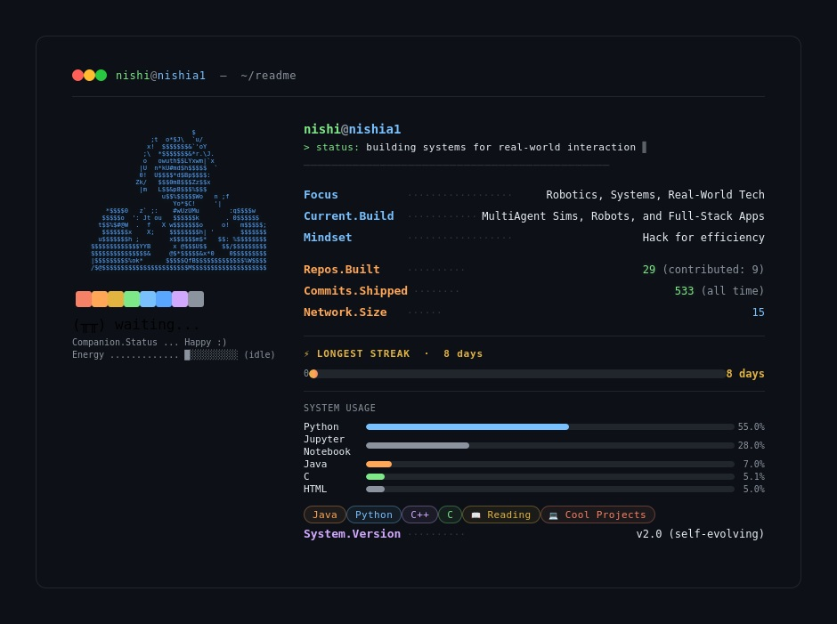
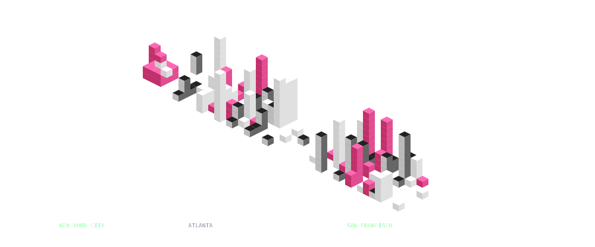

  

<picture>
  <source media="(prefers-color-scheme: dark)"  srcset="github_card_dark.jpg">
  <source media="(prefers-color-scheme: light)" srcset="github_card_light.jpg">
  
</picture>

I'm a student studying CS at Georgia Institute of Technology!

I like data-driven applications for cutting-edge technology, robots, tech for social good, and building cool stuff at hackathons :)
#

Contact me at <nagrawal66@gatech.edu>!
#

