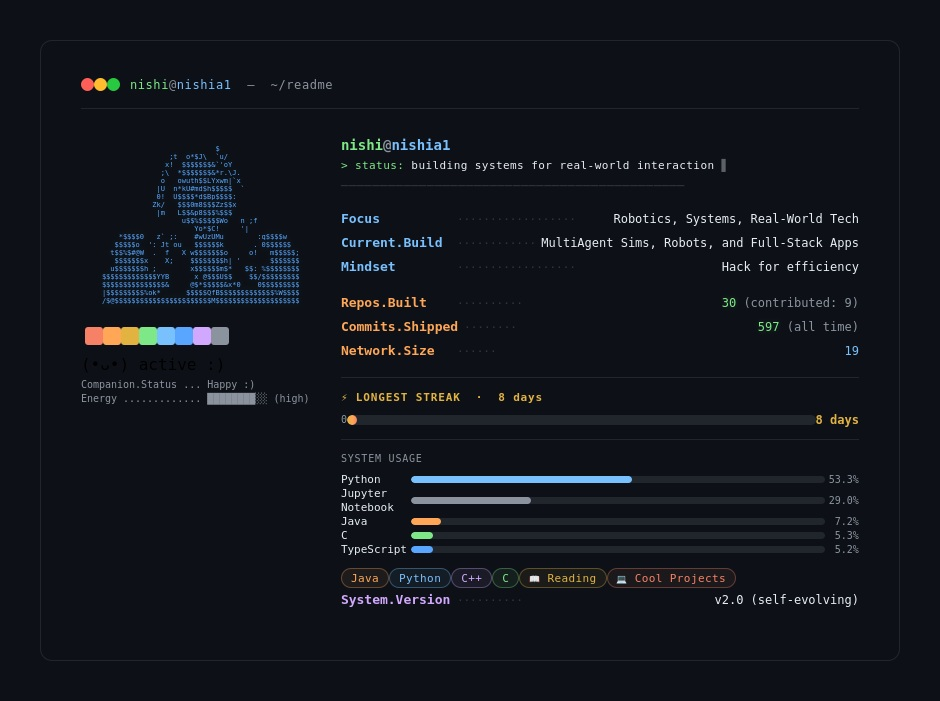

<!--- 

  

 --->
<!--- <picture>
  <source media="(prefers-color-scheme: dark)"  srcset="github_card_dark.jpg">
  <source media="(prefers-color-scheme: light)" srcset="github_card_light.jpg">
  
</picture>
--->
Hi! I'm a computer science student at Georgia Tech, but I'm also a hobbyist side-project (and side quest) addict, coffee/chai consumer, and a huge fan of building!

I enjoy data-driven applications, cutting-edge technology, robots, tech for social good, and building cool stuff at hackathons as well as the tech that helps make them happen :) Working on problems that make me sweat is super enjoyable.

Some Recent Work:
- Working on RL policies to enable humanoid motion in rough terrain environments
- Hackathon maxxing!
- Building infra and tools for the Hive Makerspace (maintaining & developing new features for HUMS) and Hexlabs (the organization which runs HackGT :))

#

Contact me at <nagrawal66@gatech.edu>!
#

